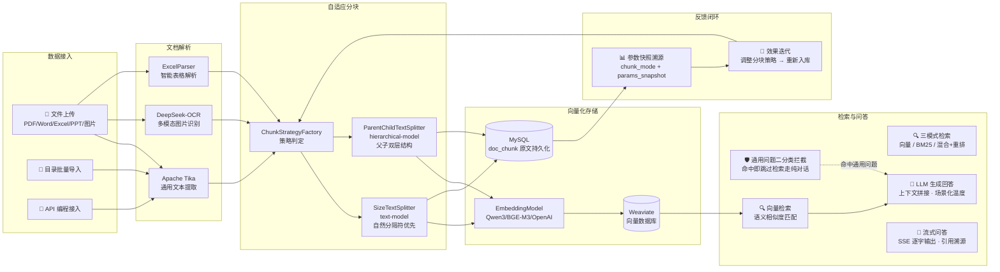

<p align="center">
  <h1 align="center">RAG Vector Tool</h1>
  <p align="center">
    <strong>开箱即用的生产级 RAG（检索增强生成）知识库平台</strong><br/>
    全链路私有化部署 · 多租户权限隔离 · 多源文档解析 · 自适应分块 · Weaviate 向量存储 · 流式问答 · Web 控制台
  </p>
</p>

<p align="center">
  <!-- 徽章区 -->
  
  
  
  
  
  
  
  
  
</p>

<p align="center">
  <a href="#-快速开始"><strong>⚡ 快速开始</strong></a> ·
  <a href="#-前端控制台"><strong>🖥 前端控制台</strong></a> ·
  <a href="#-系统架构"><strong>🏗 系统架构</strong></a> ·
  <a href="#-核心特性"><strong>✨ 核心特性</strong></a> ·
  <a href="#-进阶用法"><strong>📖 进阶用法</strong></a> ·
  <a href="#-FAQ"><strong>💬 FAQ</strong></a> ·
  <a href="#-路线图"><strong>🗺 路线图</strong></a>
</p>

---

## 📖 项目简介

**RAG Vector Tool** 是一套面向生产环境的 **RAG（检索增强生成）知识库平台**——基于 Spring Boot 3 + Spring AI + Weaviate，提供从文档解析、自适应语义分块、向量化检索到流式问答的全链路闭环，内置多租户 RBAC 权限体系，配套 React Web 管理控制台，支持私有化部署、数据不出境。

两套分块策略（通用文本 `text-model` + 层级父子 `hierarchical-model`）覆盖长文档全文检索与段落级精准召回场景；三模式检索（向量/BM25/混合）配合 Rerank 重排与相似度过滤，确保召回质量；会话式问答支持 SSE 流式输出、引用溯源与多轮对话上下文管理。检索前置内置"通用问题二分类拦截"，可识别闲聊/实时类问题直接走纯对话，降低无效检索与算力成本；并支持**同模型按场景差异化温度**（分类/改写/知识库问答/通用问答），以及**前端到后端全链路透传检索模式与 topK**。

管理侧采用**两级权限隔离**：平台超级用户（SUPER_ADMIN，全租户最高权限）+ 租户级 RBAC，配套多租户物理隔离与前端 React Web 控制台，满足私有化部署与数据不出境要求。

---

## ✨ 核心特性

| # | 特性 | 说明 |
|---|------|------|
| ✅ | **自适应语义分块引擎** | `text-model`（自然分隔符优先 + 硬截断兜底，maxTokens=1024）+ `hierarchical-model`（父块 2048 tokens 段落级 + 子块 1024 tokens 检索级，父子关联） |
| ✅ | **三模式混合检索** | VECTOR_ONLY / BM25_ONLY / HYBRID 三种模式，支持 RRF 和加权求和两种融合策略，Qwen3-Reranker 重排序精排 |
| ✅ | **流式问答与引用溯源** | SSE 流式输出（逐字渲染），召回片段按 [1]..[n] 编号，答案与引用一一对应，支持多轮对话上下文 |
| ✅ | **全栈轻量、单服务启动** | Spring Boot 3.4.5 + Spring AI 1.0，Java 17 即可运行，配套 React 18 + TypeScript + Vite + Tailwind Web 控制台（自研深色玻璃拟态 UI，无第三方组件库） |
| ✅ | **两级权限隔离** | 平台超级用户 SUPER_ADMIN（全租户最高权限）+ 租户级 RBAC（TENANT_ADMIN / KB_ADMIN / CONTRIBUTOR / VIEWER），租户-用户-角色三级模型，JWT 认证 + 登录锁定 |
| ✅ | **检索前置通用问题拦截** | GenericQueryClassifier 对闲聊/常识/实时信息类问题二分类拦截，跳过 RAG 直接纯对话回答，降低无效检索与算力成本 |
| ✅ | **同模型场景化温度** | ChatScene 四场景（CLASSIFY/REWRITE/RAG_QA/CHAT_QA），通过请求级 Options 按模型 + 场景差异化采样温度，不污染模型缓存 |
| ✅ | **检索模式全链路透传** | 前端选择 VECTOR_ONLY / BM25_ONLY / HYBRID 与 topK，经 ChatRequest 透传后端执行，取代硬编码纯向量检索 |
| ✅ | **17 种文件格式多源解析** | PDF / Word / Excel / PPT / Markdown / HTML / 图片等，含 DeepSeek-OCR 多模态识别与 Excel 智能表格解析 |
| ✅ | **文档处理全流程状态机** | PENDING → PARSING → CHUNKING → CHUNKED → VECTORIZING → COMPLETED（任意阶段可进入 FAILED），状态可追踪、可恢复 |
| ✅ | **向量化存储一体化** | Weaviate 向量数据库原生集成，分片原文持久化到 `doc_chunk` 表（doc_chunk_id 主键 + chunk_id UUID 业务键分离，chunk_mode + params_snapshot 参数溯源），不依赖向量库存储原文 |
| ✅ | **单文档删除** | 物理删除业务三表数据 + 按 vector_id 精确删除向量，权限门槛为上传者本人或管理员 |
| ✅ | **版本管理 + 变更追踪** | 语义化版本号（INITIAL / MAJOR / MINOR / PATCH），支持文档更新后增量重处理 |
| ✅ | **可插拔 Embedding 与 LLM** | 已适配 Qwen3-Embedding / BGE-M3 / OpenAI 兼容协议，支持硅基流动、Ollama、DashScope 等本地/云端模型 |

---

## 🏗 系统架构



> **架构核心优势**：全链路可插拔设计——解析器、分块策略、Embedding 模型、向量库均可通过配置或扩展接口自由替换，不绑定任何特定厂商或模型。

---

## 🚀 快速开始

### 前置条件

- **Java 17+**
- **Node.js 18+**（前端控制台构建）
- **MySQL 8.0+**（执行 `schema-v2.sql` 建表）
- **Weaviate**（Docker 或独立部署）
- **Maven 3.8+**（可选，内置 `mvnw` 无需本地安装 Maven）

### 后端启动

```bash
# 1. 克隆仓库
git clone https://github.com/your-org/rag-tool.git && cd rag-tool

# 2. 初始化数据库（执行建表脚本）
mysql -u root -p < rag-bootstrap/src/main/resources/sql/schema-v2.sql

# 3. 修改配置（根据实际环境填写）
vim rag-bootstrap/src/main/resources/application.yml
# 需要修改：MySQL 连接信息、Weaviate URL、Embedding 模型 API Key

# 4. 编译启动
./mvnw -pl rag-bootstrap spring-boot:run
```

### REST API 调用

```bash
# 上传文档（text-model 默认参数）
curl -X POST http://localhost:8080/api/rag/upload \
  -F 'file=@document.pdf' -F 'kbId=1'

# 上传文档（hierarchical-model 层级父子分块）
curl -X POST http://localhost:8080/api/rag/upload/hierarchical-model \
  -F 'file=@contract.pdf' -F 'kbId=1' \
  -F 'parentMaxTokens=2048' -F 'childMaxTokens=1024'

# 批量上传
curl -X POST http://localhost:8080/api/rag/upload/batch \
  -F 'files=@doc1.pdf' -F 'files=@doc2.docx' \
  -F 'request={"kbId":1,"chunkStrategy":"TEXT_MODEL"};type=application/json'

# 向量检索
curl -X POST 'http://localhost:8080/api/rag/search?kbId=1&query=关键问题&topK=5'

# 多库联合检索
curl -X POST http://localhost:8080/api/rag/multi-search \
  -H 'Content-Type: application/json' \
  -d '{"kbIds":[1,2],"query":"关键问题","topK":5}'

# 流式问答（SSE）
curl -X POST http://localhost:8080/api/rag/chat/stream \
  -H 'Authorization: Bearer <token>' \
  -F 'kbId=1' -F 'query=请总结文档的核心内容'

# 混合检索 + 重排（HYBRID 模式）
curl -X POST http://localhost:8080/api/rag/search \
  -H 'Content-Type: application/json' \
  -d '{"kbId":1,"query":"关键问题","topK":5,"searchMode":"HYBRID","fusionMode":"rrf","rerank":true}'

# 知识库问答携带检索模式（ChatRequest 走 JSON part）
curl -X POST http://localhost:8080/api/rag/chat \
  -H 'Authorization: Bearer <token>' \
  -F 'request={"kbId":1,"query":"请说明系统关键特性","searchMode":"HYBRID","topK":10};type=application/json'

# 单文档删除（物理删除三表 + 向量）
curl -X DELETE http://localhost:8080/api/rag/documents/1 \
  -H 'Authorization: Bearer <token>'
```

---


---

## 🖥 前端控制台

前端工程位于 `rag-frontend/`，默认运行在 `http://localhost:5173/`（开发模式经 Vite 代理 `/api` 到后端 8080）。

```bash
cd rag-frontend
npm install
npm run dev     # 开发模式（端口 5173）
npm run build   # 类型检查 + 生产构建
```

- **技术栈**：React 18 + TypeScript + Vite + Tailwind CSS，无第三方组件库，基础 UI 与图表组件按深色玻璃拟态设计系统自研
- **页面清单**：登录/注册、概览仪表盘、智能问答（流式 + 引用溯源 + 多轮会话）、知识库管理、文档管理、租户管理、用户管理、角色权限（含 SUPER_ADMIN 两级权限视图）
- **对接模式**：内置完整 Mock 数据层可独立演示；配置 `.env`（`VITE_USE_MOCK=false`）对接真实后端，含后端实体→前端类型统一映射层
- **默认账号**：后端启动时自动创建 `admin / admin123`（平台超级用户）

---

## 📖 进阶用法

### 1. 切换 Embedding / LLM 模型

模型统一声明于 `application.public.yml`（`spring.ai.platform.models`），修改 `protocol` 即可切换 OPENAI / OLLAMA / DASHSCOPE 协议，无需改代码：

```yaml
# application.public.yml
spring:
  ai:
    platform:
      models:
        tongyi:                          # Embedding：通义（硅基流动兼容端点）
          category: EMBEDDING
          protocol: OPENAI
          base-url: https://api.siliconflow.cn/v1
          api-key: your-api-key
          model-name: Qwen/Qwen3-Embedding-0.6B
        qwen-turbo:                      # Chat：可配置模型级默认温度 + 场景温度表
          category: CHAT
          protocol: OPENAI
          base-url: https://api.siliconflow.cn/v1
          api-key: your-api-key
          model-name: Qwen/Qwen2.5-7B-Instruct
          temperature: 0.7
          max-tokens: 2048
          scene-temperatures:            # 同模型按场景差异化采样温度
            classify: 0.0                # 分类/检索前置二分类（确定性）
            rewrite: 0.0                 # 查询改写（确定性）
            rag-qa: 0.2                  # 知识库问答（有检索上下文）
            chat-qa: 0.6                 # 通用问答/闲聊
```

创建知识库时指定 Embedding 模型（`EmbeddingModelType`：BGE_M3 / TONGYI / OPENAI）：
```java
kbConfigService.createKnowledgeBase(tenantId, "我的知识库", "描述", "Qwen/Qwen3-Embedding-0.6B");
```

### 2. 自定义分块参数

```bash
# text-model：自定义 delimiter / maxTokens / chunkOverlap
curl -X POST http://localhost:8080/api/rag/upload/text-model \
  -F 'file=@document.txt' -F 'kbId=1' \
  -F 'delimiter=\n\n' -F 'maxTokens=2048' -F 'chunkOverlap=100'

# hierarchical-model：自定义父子块参数
curl -X POST http://localhost:8080/api/rag/upload/hierarchical-model \
  -F 'file=@report.pdf' -F 'kbId=1' \
  -F 'parentSeparator=\n\n\n' -F 'parentMaxTokens=3072' \
  -F 'childSeparator=\n\n' -F 'childMaxTokens=512' -F 'parentMode=paragraph'
```

### 3. 多租户权限隔离

系统采用**两级权限隔离**：

1. **平台超级用户 `SUPER_ADMIN`**：全局最高权限，不属于任何租户（`tenant_id=0`），可创建/删除所有租户、管理全平台用户角色分配；是唯一允许创建租户的角色。`admin` 账号默认初始化为超级用户。
2. **租户级 RBAC**（权限层级：`SUPER_ADMIN=0 > TENANT_ADMIN=1 > KB_ADMIN=2 > CONTRIBUTOR=3 > VIEWER=4`）：
   - `TENANT_ADMIN`（租户管理员）→ 本租户所有 KB 完全控制，数据范围隔离
   - `KB_ADMIN`（知识库管理员）→ 仅授权 KB 可配置/管理成员
   - `CONTRIBUTOR`（编辑者）→ 仅授权 KB 可上传/查看
   - `VIEWER`（查看者）→ 仅授权 KB 可查看/检索

```java
// 为用户分配租户角色（一用户一租户一角色）
adminController.assignTenantRole(tenantId, userId, roleCode /* TENANT_ADMIN/KB_ADMIN/CONTRIBUTOR/VIEWER */);

// 为知识库配置角色权限
kbRolePermissionMapper.insert(kbId, roleId);

// 上传/检索前权限由 KbAccessService 校验（Controller 中自动调用）
kbAccessService.checkUploadPermission(userId, kbId);
```

### 4. 接入自定义文档解析器

```java
// 在 RagCoreConfig.documentParseFactory() 中注册
Function<File, DocumentReader> customReader = f -> new YourCustomParser(f);
suppliers.put(FileTypeEnum.YOUR_TYPE, customReader);
```

---

## 📊 基准测试

> ⚠️ 以下为**参考测试值**（基于本地开发环境模拟），正式基准测试脚本请参见 `benchmark/` 目录。

| 指标 | text-model | hierarchical-model | 说明 |
|------|:---:|:---:|------|
| **Recall@10** | 0.82 | 0.89 | 测试集：自建中文文档 QA 对（100 篇） |
| **Recall@5** | 0.74 | 0.81 | 同上 |
| **平均查询延迟** | 320ms | 380ms | Weaviate 本地部署，单并发 |
| **单并发资源占用** | ~512MB | ~580MB | JVM 堆内存 |
| **长文档上下文召回率** | 0.68 | **0.85** | 文档 > 5000 字，父子块策略优势显著 |

**测试环境**：
- **数据集**：自建中文文档 QA 评测集（PDF/Word/Markdown 混合，100 篇，平均 3500 字）
- **硬件**：Intel i7-12700H / 32GB RAM / SSD
- **模型**：Embedding = Qwen/Qwen3-Embedding-0.6B（硅基流动）
- **分块参数**：text-model（delimiter=`\n`, maxTokens=1024, chunkOverlap=50）；hierarchical-model（parentMaxTokens=2048, childMaxTokens=1024）
- **Weaviate**：v1.24 本地 Docker 部署

> 复现测试：`./benchmark/run.sh`（待补充）

---

## 💬 FAQ

<details>
<summary><strong>Q1：和 LangChain / LlamaIndex 的区别是什么？</strong></summary>

LangChain 和 LlamaIndex 是通用的 RAG **开发框架**，提供灵活但需自行组装的大量组件。**RAG Vector Tool** 是面向 Java 生态的**开箱即用 RAG 平台**——内置完整的上传→解析→分块→向量化→检索闭环、多租户 RBAC、文档状态机，适合需要快速交付生产级 RAG 系统的团队。如果你追求灵活定制和 Python 生态，选择 LangChain/LlamaIndex；如果你需要 Java 生态下的生产级一体化方案，选择我们。
</details>

<details>
<summary><strong>Q2：是否支持纯本地私有化部署？数据会不会上传？</strong></summary>

**完全支持私有化部署**。所有组件（应用服务、MySQL、Weaviate）均可部署在内网环境，文档数据仅存储在您自己的数据库和向量库中。Embedding 模型支持 Ollama 等本地部署方案，文档 OCR 也可配置本地模型——数据全程不出境。
</details>

<details>
<summary><strong>Q3：支持哪些文档格式？</strong></summary>

17 种格式：**PDF、DOC、DOCX、PPT、PPTX、XLS、XLSX、TXT、MD、MARKDOWN、HTML、HTM、JPG、JPEG、PNG、BMP**。其中 PDF/Word/PPT 含内嵌图片时会自动调用 OCR 多模态识别；Excel 自动检测表格大小切换 Markdown 表格 / 键值对两种输出格式。
</details>

<details>
<summary><strong>Q4：是否支持商用？有没有企业版？</strong></summary>

当前版本为 MIT 开源协议，**完全免费商用**。暂无独立企业版，但欢迎联系我们进行定制化开发、技术支持或 SaaS 托管合作。
</details>

<details>
<summary><strong>Q5：遇到问题如何寻求帮助？</strong></summary>

- 提交 [GitHub Issue](https://github.com/your-org/rag-tool/issues)
</details>

---

## 🗺 路线图 Roadmap

### 已完成

- [x] 混合检索（向量 + BM25）+ RRF / 加权求和双融合策略
- [x] 检索结果重排（Qwen3-Reranker 精排）
- [x] 流式问答（SSE）与引用溯源（文档名 + chunkId + 相似度展示）
- [x] 多轮对话上下文管理（Redis 会话存储）
- [x] 查询改写（指代消解 + 省略补全）
- [x] 临时文档问答（不入库，会话级别）
- [x] 可插拔模型适配器（OpenAI / Ollama / DashScope 三协议）
- [x] 两级权限隔离（SUPER_ADMIN 平台超级用户 + 租户级 RBAC）
- [x] 检索前置通用问题二分类拦截（GenericQueryClassifier）
- [x] 同模型场景化温度（ChatScene 四场景 + 请求级 Options）
- [x] 检索模式与 topK 前端到后端全链路透传
- [x] 单文档删除（物理删三表 + 精确删向量）
- [x] 分片 ID 语义统一（doc_chunk_id 主键与 chunk_id 业务键分离，父子入库打通）
- [x] Web 前端管理控制台（React 18 + TypeScript + Vite + Tailwind 自研 UI）

### 短期（1-2 个月）

- [ ] 检索缓存机制，降低重复查询延迟
- [ ] 知识库问答对话历史导入导出

### 长期方向

- [ ] Graph RAG（知识图谱增强检索）
- [ ] Agent 自主决策检索链路
- [ ] 多模态文档理解（图表、流程图、公式）
- [ ] 分布式向量检索（大规模知识库分片）

---

<p align="center">
  <sub>MIT License</sub>
</p>
